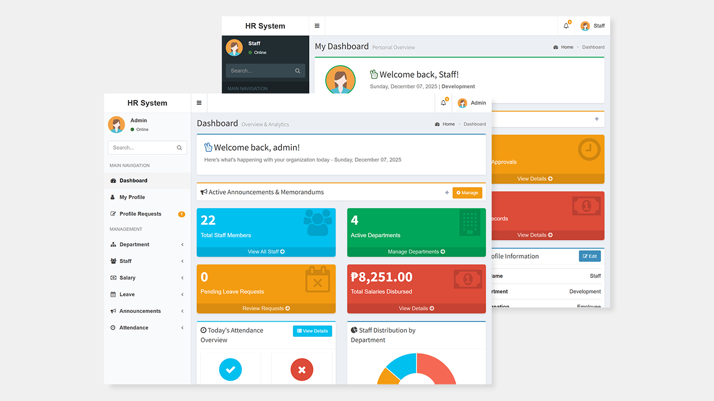
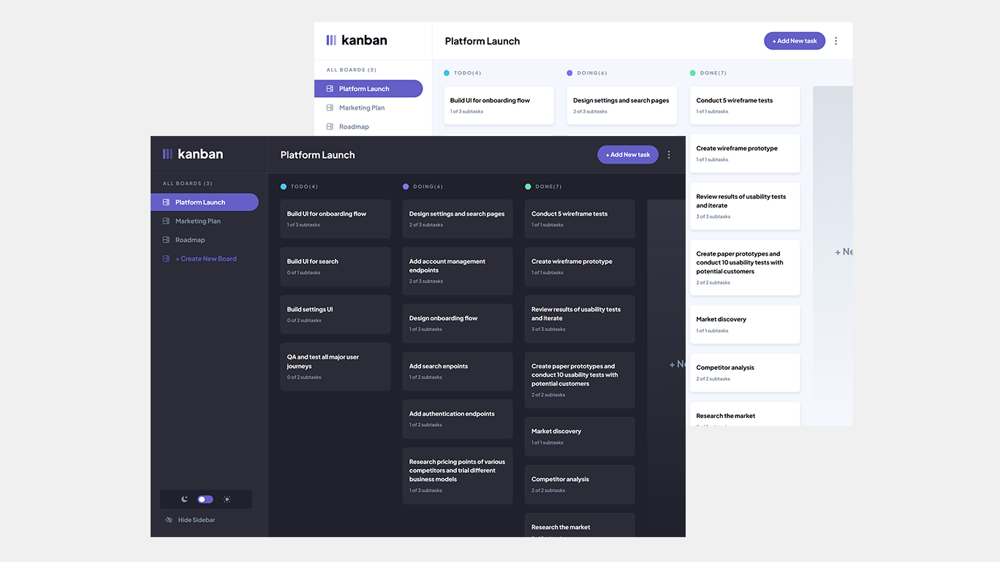
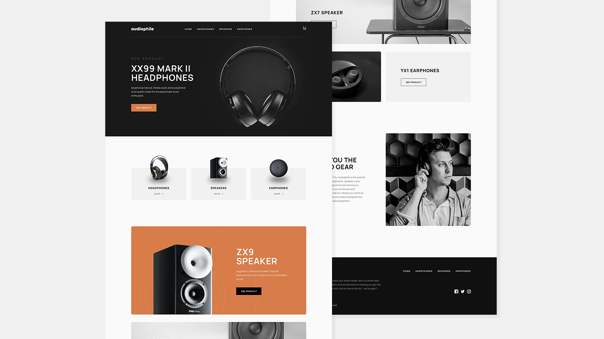

<!-- Banner Image -->

  
  
  
  
  

---

## 👋 About Me

Hey there! I'm Paula Isabel, a **Full Stack PHP Developer** passionate about building web applications and solving real-world problems with code. I love working with modern frameworks, crafting clean APIs, and creating seamless user experiences.

### 🎯 What I Do

- 💻 Build full-stack web applications with **PHP** and **React**
- 🔄 Design and develop **RESTful APIs**
- 📊 Create data-driven **dashboards** and reporting tools
- ⚡ Optimize database performance and system architecture
- ✍️ Write technical articles on the [OSSPH blog](https://blog.ossph.org/) to help fellow developers
- 🌟 Contribute actively to open source projects

---

## 🔧 Technical Stack

### Backend Development

**Expertise:** RESTful API Development • MVC Architecture • Database Design & Optimization • Server-side Logic • CRUD Operations • Query Optimization

### Frontend Development

**Expertise:** Single Page Applications • Responsive Design • DOM Manipulation • Cross-browser Compatibility

### Styling & UI Frameworks

### Development Tools & Workflow

### Additional Technologies

---

## 📊 GitHub Statistics

  

  
  

  
  

---

## 📂 Featured Projects

As an open source enthusiast, I keep all of my personal projects on GitHub and Codepen. I've completed **20+ projects**, but here are a few that stand out:

<table>
  <tr>
    <td width="50%" valign="top">
      <h3 align="center">HR Management System</h3>
       
      
       
      

          
        
      

      
<strong>PHP • CodeIgniter • MySQL • JavaScript • Bootstrap</strong>

      
A comprehensive web application for managing HR operations including employee records, attendance tracking, leave management, payroll processing, and company announcements.

      
✨ <strong>Key Features:</strong> Role-based access control, automated payroll calculations, real-time attendance monitoring

    </td>
    <td width="50%" valign="top">
      <h3 align="center">Kanban Task Management App</h3>
       
      
       
      

        
        
      

      
<strong>React.js • TypeScript • CSS</strong>

      
A modern drag-and-drop task management application with customizable boards, subtask tracking, and seamless theme switching between light and dark modes.

      
✨ <strong>Key Features:</strong> Drag-and-drop functionality, persistent storage, responsive design

    </td>
  </tr>
  
  <tr>
    <td width="50%" valign="top">
      <h3 align="center">Audiophile E-Commerce</h3>
       
      
       
      

        
        
      

      
<strong>React.js • TypeScript • CSS</strong>

      
A fully functional e-commerce platform for audio gear featuring product browsing, shopping cart management, and a complete checkout process with form validation.

      
✨ <strong>Key Features:</strong> Product catalog, cart state management, checkout flow, order confirmation

    </td>
    <td width="50%" valign="top">
      <h3 align="center">Character Counter</h3>
       
      
       
      

        
        
      

      
<strong>React.js • TypeScript • Sass</strong>

      
A real-time text analysis tool providing detailed insights into your writing, including character and word counts, sentence analysis, estimated reading time, and letter frequency distribution.

      
✨ <strong>Key Features:</strong> Real-time analysis, intuitive UI, comprehensive metrics, letter density visualization

    </td>
  </tr>
</table>

  

---

## 🖊️ Latest Blog Posts

Writing technical articles to share knowledge and help fellow developers grow. Check out my recent posts on the OSSPH blog:

<!-- BLOG-POST-LIST:START -->
- [BetterGov.ph: How ₱3,000 and civic anger sparked a movement for transparency](https://blog.ossph.org/bettergov-ph-how-3-000-and-civic-anger-sparked-a-movement-for-transparency/)
- [FRUI: The Minimalist React UI Component Library You've Been Waiting For](https://blog.ossph.org/frui-the-minimalist-react-ui-component-library-youve-been-waiting-for/)
- [Introducing Balota: An Open-Source Website to Help You Generate Your Ballot for the 2025 Elections](https://blog.ossph.org/introducing-balota-an-open-source-website-to-help-you-generate-your-ballot-for-the-2025-elections/)
- [Ctrl Alt Run: Where Techies Traded Keyboards for Running Shoes](https://blog.ossph.org/ctrl-alt-run-where-techies-traded-keyboards-for-running-shoes/)
- [Weaving Tomorrow's Techscape: Key Takeaways from SOSCONPH 2024](https://blog.ossph.org/weaving-tomorrows-techscape-key-takeaways-from-sosconph-2024/)
<!-- BLOG-POST-LIST:END -->

  

---

## 🚀 Currently

- 🔭 **Working on:** Enterprise HQ management systems at Point One Integrated Technologies Inc.
- 🌱 **Learning:** Advanced database optimization techniques and microservices architecture
- 👯 **Open to:** Collaborating on open source PHP and React projects
- 💬 **Ask me about:** PHP, CodeIgniter, React.js, RESTful APIs, Database Optimization, POS Systems
- 📫 **Reach me:** codewithpaula@gmail.com
- ⚡ **Fun fact:** When I'm not coding, you'll find me exploring new tech or contributing to open source!

---

## 📈 Recent GitHub Activity

<!--START_SECTION:activity-->
1. 🎉 Merged PR [#1](https://github.com/paulaxisabel/nft-minting/pull/1) in [paulaxisabel/nft-minting](https://github.com/paulaxisabel/nft-minting)
2. 🎉 Merged PR [#2](https://github.com/paulaxisabel/nft-minting/pull/2) in [paulaxisabel/nft-minting](https://github.com/paulaxisabel/nft-minting)
<!--END_SECTION:activity-->

---

## 💡 Let's Connect!

I'm always excited to connect with fellow developers, collaborate on interesting projects, or discuss tech! Feel free to reach out:

  
  
  
  

---

  

  <i>⭐️ If you find my projects interesting, consider giving them a star!</i>

