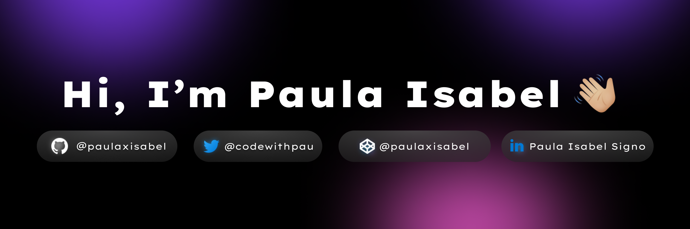

# 👋 Hello, folks 
My name is **Paula** and I am a 💻 **Fullstack Software Engineer**. I make elegantly professional 🌐 **websites** and also 📝 **write some blogs**. 🌈    

* 😄   she/her
* 💻   SWE at 100devs
* 🎯   AWS Certified Cloud Practitioner
* ✍🏻   I am a Technical Writer at <a href="https://ossph.org/">Open Source Software PH</a>
* 🌱   Currently learning APIs, Javascript, and OOP
* ⛳   Contributing to Open Source Projects, writing, learning languages
* 🧐   Interested in UX/UI Design

## 🔧 Technologies & Tools

## &#x1f4c8; Stats
<table>
<tr>
<td>

</td>
<td>

</td>
</tr>
</table>

## 🤝🏻 Connect With Me

