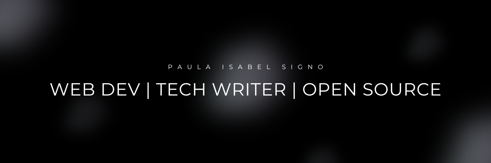
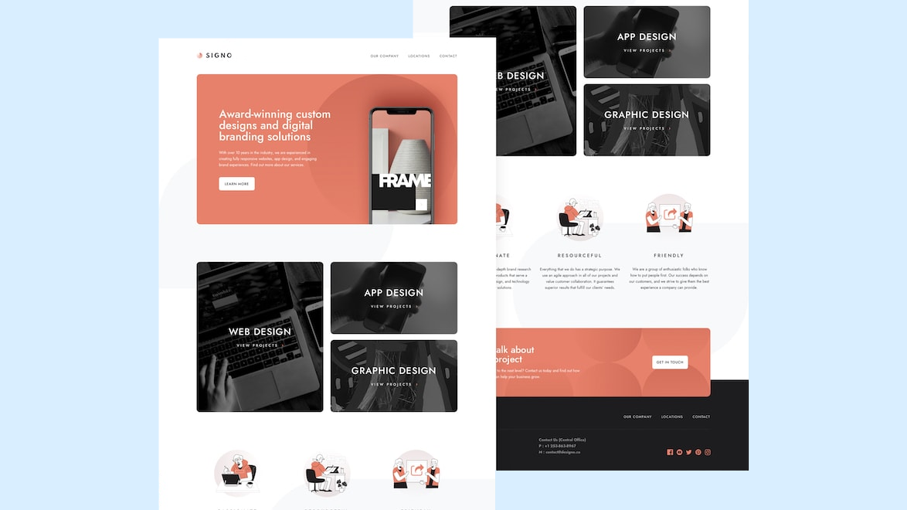
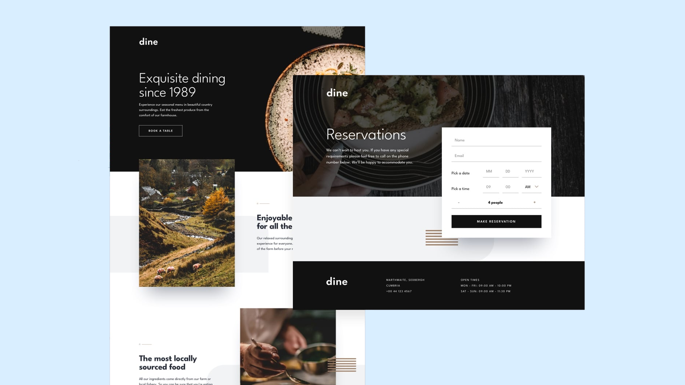
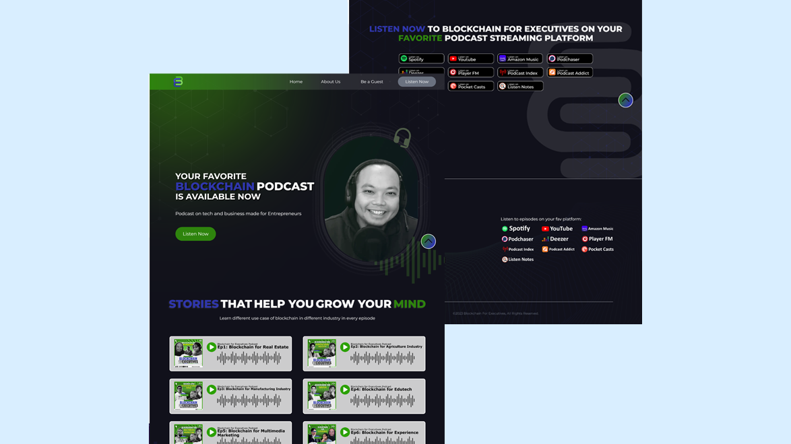
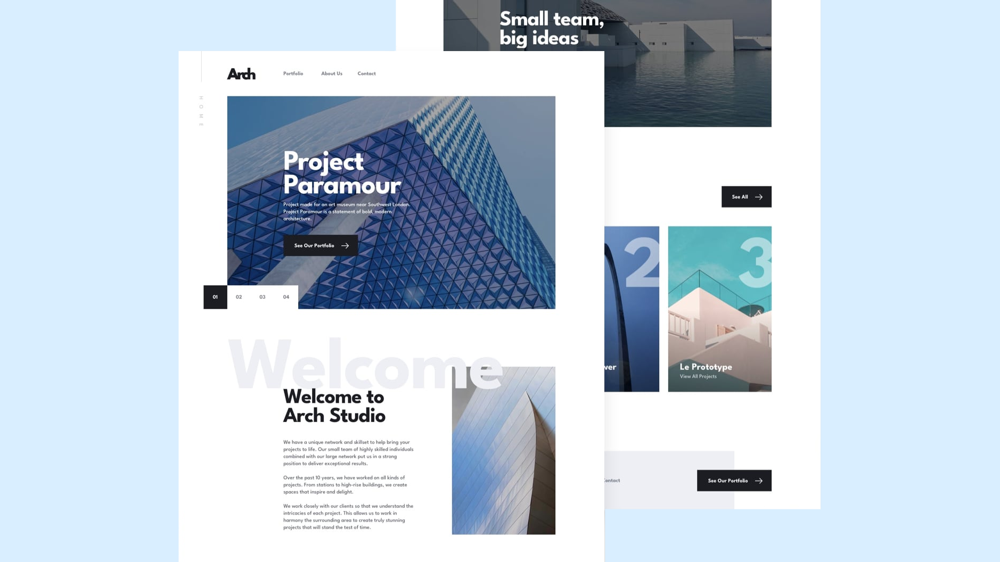

<!-- Banner Image -->

<!-- About -->
## 👋 About Me

Hello,

My name is Paula Isabel. I'm a Web Application developer who loves coming up with new projects and ideas. I am passionate about open source and actively contribute to it. I've recently developed an interest in writing technical articles in order to help other developers. My work can be found on the [OSSPH blog](https://blog.ossph.org/).

Feel free to DM or ask me any questions you may have. 

<!-- Tech Stack -->
## 🔧 Technologies & Tools

<!-- Featured Projects -->

## 📂 Featured Projects
As an open source enthusiast, I keep all of my personal projects on GitHub and Codepen. I've completed over 20 projects, but here are a few that stand out:

<table bordercolor="#66b2b2">
  
  <tr>
    <td width="50%" valign="top">
      <h3 align="center">Signo</h3>
         
        
         
        

          
    
  
      

        
<strong>HTML, CSS, Javascript, JQuery, & LeafletJS</strong> - A multi-page website for a web development company that includes a contact form and a map with actual locations on it

    </td>
    <td width="50%" valign="top">
      <h3 align="center">Dine Restaurant</h3>
         
      
         
        

          
  
  
      

        
<strong>HTML, Sass, & JQuery</strong> - A multi-page restaurant website with a booking form

    </td>
  </tr>
  
  <tr>
    <td width="50%" valign="top">
      <h3 align="center">Blockchain for Executives</h3>
       
        
       
        

  
  
      

        
<strong>NextJS, & Tailwind CSS</strong> - A website for a podcast on tech and business made for entrepreneurs

    </td>
    <td width="50%" valign="top">
      <h3 align="center">Arch</h3>
         
        
         
        

          
  
  
      

        
<strong>ReactJS, Vite, LeafletJS, Sass, HTML</strong> - A multi-page website for an architect firm that includes a contact form and a map with actual locations on it

    </td>
  </tr>
</table>

## 🖊️ Recent Blog Posts

<!-- BLOG-POST-LIST:START -->
- [BetterGov.ph: How ₱3,000 and civic anger sparked a movement for transparency](https://blog.ossph.org/bettergov-ph-how-3-000-and-civic-anger-sparked-a-movement-for-transparency/)
- [FRUI: The Minimalist React UI Component Library You&#39;ve Been Waiting For](https://blog.ossph.org/frui-the-minimalist-react-ui-component-library-youve-been-waiting-for/)
- [Introducing Balota: An Open-Source Website to Help You Generate Your Ballot for the 2025 Elections](https://blog.ossph.org/introducing-balota-an-open-source-website-to-help-you-generate-your-ballot-for-the-2025-elections/)
- [Ctrl Alt Run: Where Techies Traded Keyboards for Running Shoes](https://blog.ossph.org/ctrl-alt-run-where-techies-traded-keyboards-for-running-shoes/)
- [Weaving Tomorrow&#39;s Techscape: Key Takeaways from SOSCONPH 2024](https://blog.ossph.org/weaving-tomorrows-techscape-key-takeaways-from-sosconph-2024/)
<!-- BLOG-POST-LIST:END -->

## ✨ Recent GitHub Activity

<!--START_SECTION:activity-->
1. 🎉 Merged PR [#1](https://github.com/paulaxisabel/nft-minting/pull/1) in [paulaxisabel/nft-minting](https://github.com/paulaxisabel/nft-minting)
2. 🎉 Merged PR [#2](https://github.com/paulaxisabel/nft-minting/pull/2) in [paulaxisabel/nft-minting](https://github.com/paulaxisabel/nft-minting)
<!--END_SECTION:activity-->
